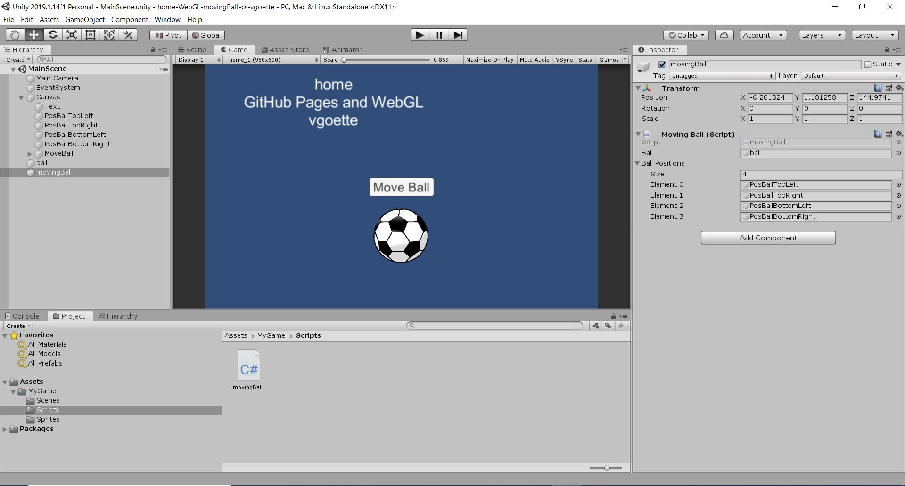

# inclass-WebGL-cs-vgoette

### Project description: 
The project consists of a canvas (960x600), with a button, a text, four Empty Game Objects, a GameObject ball (imported) and a script 

When the button is pressed the ball moves randomly to one of four positions (PosBottomLeft, PosBottomRight, PosTopLeft, PosTopRight )

### Development platform: 
* Windows 10; 
* Unity Version: 2019.1.14f1; 
* Visual Studio Version: Microsoft Visual Studio Community 2017;

### Target platform: 
WebGL incl. reference resolution 960x600 

### Visuals: 

### Third party material: 
<a href="https://image.flaticon.com/icons/svg/53/53283.svg">Fußball PNG</a>

### Project State:
undone

### Limitations: 
WebGL

### Lessons Learned: 
* make a GUI

Copyright by vgoette